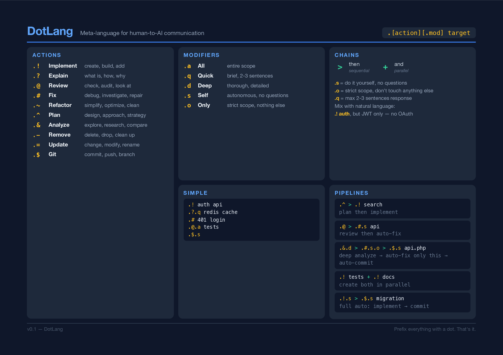
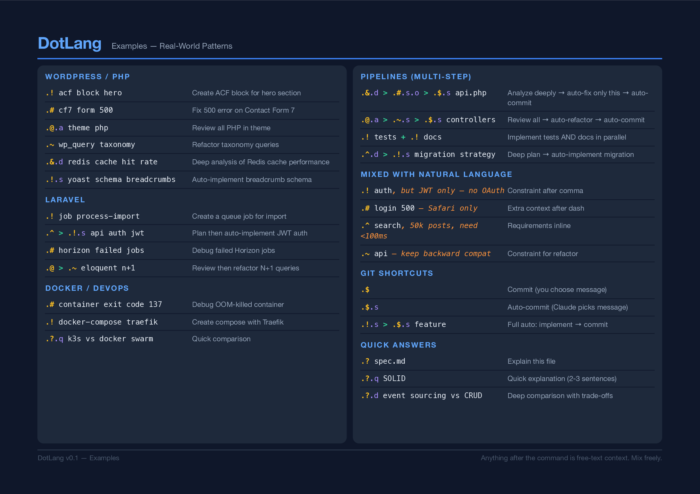

# DotLang

A shorthand meta-language for human-to-AI communication. Type less, say more.

Instead of spending 2 minutes explaining what you want, write it in 3 seconds:

```
.&.d > .#.s.o > .$.s api.php
```

This means: *analyze deeply → auto-fix only this file → auto-commit*

## Install

One command to add DotLang to your Claude Code:

```bash
curl -fsSL https://raw.githubusercontent.com/dimonchoo/dotlang/main/install.sh | bash
```

This downloads the DotLang ruleset to `~/.claude/dotlang/` and imports it into your global `CLAUDE.md`.

### Uninstall

```bash
curl -fsSL https://raw.githubusercontent.com/dimonchoo/dotlang/main/install.sh | bash -s -- --uninstall
```

## Quick Reference

### Actions

| Symbol | Action | Aliases |
|--------|--------|---------|
| `.!` | Implement | create, build, add |
| `.?` | Explain | what is, how, why |
| `.@` | Review | check, audit, look at |
| `.#` | Fix | debug, investigate, repair |
| `.~` | Refactor | simplify, optimize, clean |
| `.^` | Plan | design, approach, strategy |
| `.&` | Analyze | explore, research, compare |
| `.-` | Remove | delete, drop, clean up |
| `.=` | Update | change, modify, rename |
| `.$` | Git | commit, push, branch |

### Modifiers

| Suffix | Meaning | Effect |
|--------|---------|--------|
| `.a` | All | entire scope |
| `.q` | Quick | 2-3 sentences max |
| `.d` | Deep | thorough, detailed |
| `.s` | Self | autonomous, no questions asked |
| `.o` | Only | strict scope, nothing else |

### Chains

| Operator | Meaning |
|----------|---------|
| `>` | then (sequential) |
| `+` | and (parallel) |

## Examples

```bash
# Simple commands
.! auth api                     # implement auth for API
.?.q redis cache                # briefly explain redis cache
.# 401 login                    # fix 401 error on login
.@.a tests                      # review all tests

# With modifiers
.!.s auth middleware             # implement autonomously
.#.o login form                 # fix only the login form
.&.d api performance            # deep analysis

# Pipelines
.^ > .! search                  # plan → implement
.@ > .#.s api                   # review → auto-fix
.! tests + .! docs              # both in parallel
.!.s > .$.s feature             # auto-implement → auto-commit

# Mix with natural language
.! auth, but JWT only — no OAuth
.# login 500 — users report on Safari only
.^ search, we have 50k posts, need <100ms
```

## How It Works

DotLang is a convention — a set of rules that Claude learns from your `CLAUDE.md`. No plugins, no extensions, no runtime. Just a shared vocabulary between you and your AI.

The install script places the ruleset at `~/.claude/dotlang/CLAUDE.md` and adds a single `@import` line to your global Claude Code config.

## Files

| File | Purpose |
|------|---------|
| `CLAUDE.md` | Minimal ruleset for Claude (~1000 tokens) |
| `SPEC.md` | Full specification with all details |
| `cheatsheet.pdf` | Printable 2-page reference (A4 landscape) |
| `install.sh` | One-line installer/uninstaller |

## Cheat Sheet

[Download PDF](cheatsheet.pdf) — printable, A4 landscape, dark theme.





## License

MIT
